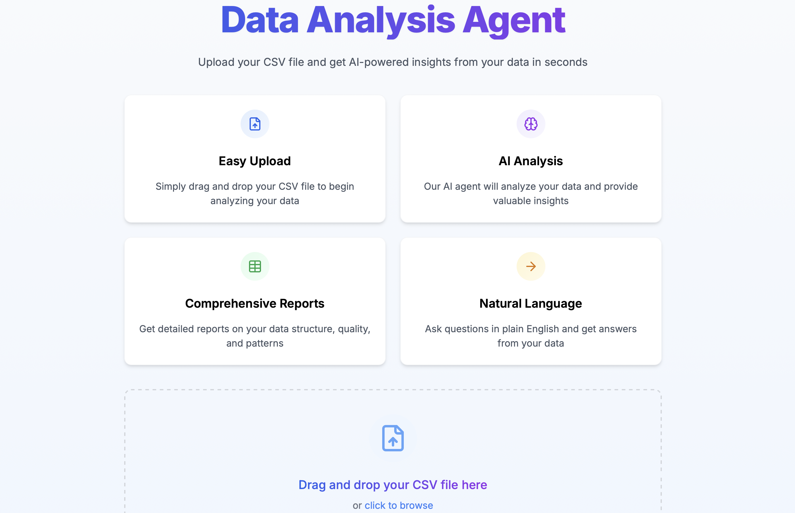

<div align="center">

# 🤖 Data Analysis Agent

[](https://nextjs.org/)
[](https://fastapi.tiangolo.com/)
[](https://www.typescriptlang.org/)
[](https://tailwindcss.com/)
[](https://opensource.org/licenses/MIT)

<p align="center">
  
</p>

A modern full-stack web application for AI-powered data analysis. Upload CSV files and get instant insights through natural language questions.

</div>

## ✨ Features

- 🔍 **Natural Language Analysis** - Ask questions about your data in plain English
- 📁 **CSV File Upload** - No file size limit for your data files
- 🧠 **AI-Powered Insights** - Powered by Llama 4 via Groq API
- 📱 **Responsive Design** - Works on desktop, tablet, and mobile devices
- 🔄 **Session Management** - Return to your analysis at any time
- ⚡ **Fast Performance** - Built with Next.js and FastAPI for speed
- 🛡️ **Type Safety** - Built with TypeScript for reliability

## 🖥️ Demo

<p align="center">
  
</p>

## 🛠️ Tech Stack

### Frontend

- **Framework**: [Next.js 14](https://nextjs.org/) with App Router
- **Language**: [TypeScript](https://www.typescriptlang.org/)
- **Styling**: [Tailwind CSS](https://tailwindcss.com/)
- **State Management**: [React Query](https://tanstack.com/query/latest)
- **Data Visualization**: [Chart.js](https://www.chartjs.org/) / [React-chartjs-2](https://react-chartjs-2.js.org/)
- **HTTP Client**: [Axios](https://axios-http.com/)

### Backend

- **Framework**: [FastAPI](https://fastapi.tiangolo.com/)
- **AI Framework**: [Agno](https://github.com/agno-ai/agno)
- **LLM Integration**: [Groq API](https://console.groq.com/) (Llama 4 Model)
- **Database**: [DuckDB](https://duckdb.org/) for analytical queries
- **Data Processing**: [Pandas](https://pandas.pydata.org/)

## 📋 Prerequisites

- **Node.js** 18+ ([Download](https://nodejs.org/))
- **Python** 3.11+ ([Download](https://www.python.org/downloads/))
- **Docker** and Docker Compose (optional, for containerized deployment) ([Download](https://www.docker.com/products/docker-desktop))
- **Groq API key** ([Get API Key](https://console.groq.com/))

## 🚀 Getting Started

### Environment Setup

Create a `.env` file in the root directory with the following variables:

```env
# Groq API Configuration
GROQ_API_KEY=your_groq_api_key_here

# Backend Configuration
BACKEND_PORT=8000
FRONTEND_PORT=3000
```

### Backend Setup

```bash
# Navigate to backend directory
cd backend

# Create and activate virtual environment
python -m venv venv
source venv/bin/activate  # On Windows: venv\Scripts\activate

# Install dependencies
pip install -r requirements.txt

# Start the development server
uvicorn app:app --reload
```

### Frontend Setup

```bash
# Navigate to frontend directory
cd frontend

# Install dependencies
npm install

# Start the development server
npm run dev
```

## 🐳 Docker Deployment

For a containerized setup, use Docker Compose:

```bash
# Build and start all services
docker-compose up --build
```

The application will be available at:
- 🌐 **Frontend**: [http://localhost:3000](http://localhost:3000)
- 🔌 **Backend API**: [http://localhost:8000](http://localhost:8000)

## ☁️ Cloud Deployment

### Vercel (Frontend)

 Deploy the frontend to Vercel:

1. Push your code to GitHub
2. Import the repository in [Vercel dashboard](https://vercel.com/dashboard)
3. Configure environment variables
4. Deploy

### Railway.app (Backend)

 Deploy the backend to Railway:

1. Push your code to GitHub
2. Import the repository in [Railway dashboard](https://railway.app/dashboard)
3. Configure environment variables
4. Deploy

## 📊 How It Works

1. **Upload CSV File**: Upload your CSV file through the intuitive drag-and-drop interface
2. **Automatic Analysis**: The system automatically analyzes your data structure
3. **Ask Questions**: Use natural language to ask questions about your data
4. **Get Insights**: Receive AI-generated insights and explanations

## � Sample Data

To help you get started quickly, we've included several sample CSV files in the `sample_data` directory:

Simply download these files and upload them to the application to start exploring the data analysis capabilities.

## �🔍 Example Queries

- "What's the average age in this dataset?"
- "Show me the correlation between income and education level"
- "Identify outliers in the sales column"
- "What are the top 5 products by revenue?"

## 🧩 Project Structure

```
/
├── frontend/               # Next.js frontend application
│   ├── public/            # Static assets
│   ├── src/               # Source code
│   │   ├── app/           # Next.js App Router
│   │   ├── components/    # React components
│   │   └── lib/           # Utility functions
│   ├── package.json       # Frontend dependencies
│   └── tailwind.config.js # Tailwind CSS configuration
│
├── backend/               # FastAPI backend application
│   ├── app.py            # Main application entry point
│   ├── routes/           # API routes
│   ├── services/         # Business logic
│   ├── models/           # Data models
│   └── requirements.txt  # Python dependencies
│
├── docker-compose.yml     # Docker Compose configuration
└── .env                   # Environment variables
```

## 🤝 Contributing

Contributions are welcome! Please feel free to submit a Pull Request.

1. Fork the repository
2. Create your feature branch (`git checkout -b feature/amazing-feature`)
3. Commit your changes (`git commit -m 'Add some amazing feature'`)
4. Push to the branch (`git push origin feature/amazing-feature`)
5. Open a Pull Request

## 📄 License

This project is licensed under the MIT License - see the [LICENSE](LICENSE) file for details.

## 📬 Contact

If you have any questions or feedback, please reach out!

---

<div align="center">

**Made with ❤️ for Data Analysts & Data Scientists**

</div>
